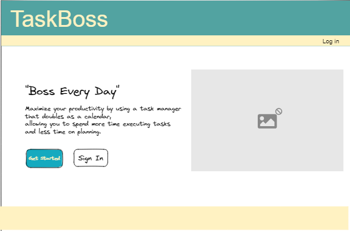
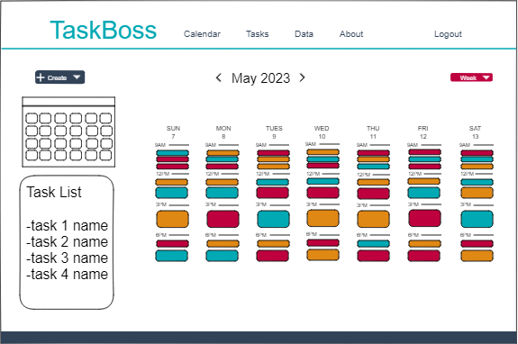
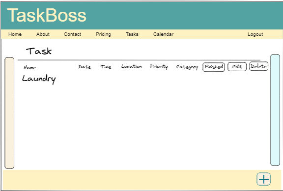
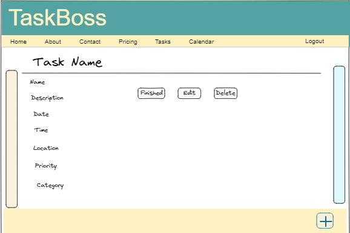

# Customer Graphical Human Interface

## Home Page

This will be the first page users arrive to on the website.
There will be a sign up or log in.

## Calendar

This page serves as a centralized hub for users to conveniently view and manage their calendar activities. With a user-friendly interface and intuitive design, it provides a seamless experience for organizing and keeping track of various events and tasks.

## Activity List

This page serves as a comprehensive dashboard where users can conveniently view and manage their activities. This page provides a detailed overview of all the activities associated with the user's calendar, allowing them to access specific event/task details and perform various actions like editing or deleting.

## Add Activity

Users can visit the activity list page which contains a list of activities which can be added through the calendar or create an activity page.

- Create an event (specify a date/time)
- Create a task

Each activity linked to the activity list.

## Activity Detail

Users can also visit the detail modal when viewing the activity list.

## About Page

- Contains a brief description of TaskBoss
- Sourcing information (DayPilot integration)
- FAQ
